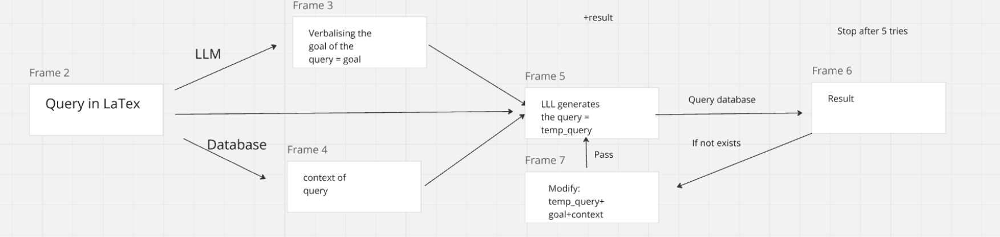

# Welcome to My Master Thesis! 😊

Hello everyone, and welcome to my first interactions with my Master thesis!  Through this work, I aim to show my current progress in a nice manner, so that my progress can be tracked.

Let's get started! 👋🏻

---

## Tables and first Pipeline

My task is to enhance basically realtional algebra expressions with the help of a LLM.
Therefore I can make use of its semantic capabilities 🧠 to enhance querying and getting better answers.

### Table 1: totalnation

| id            | nationality   | 
|---------------|---------------|
| Vladi         | Germany       |
| Pierre        | French        |

### Table 2: totalshares

| name          | shares   | 
|---------------|----------|
| Felix         | 20       |
| Vladi         | 10       |

### Table 3: totalanimal

| name          | category   | 
|---------------|------------|
| bill          | chien      |
| diego         | chat       |

My first, proposal is the following architecture. The pipeline starts with a **LaTeX expression**, which is processed by an LLM to gene to verbalize the **goal** of the query. Parallely also the database gives out the **context** of the query, meaning for in all tables all columns and their unique values are written as key-value pairs. The LLM is given the **LaTeX expression**, the **context** and the **goal** and with it is supposed to generate the SQL query, the **temp_query** . The **temp_query** is run on the database. If no result is given, the LLM is given the **temp_query** and again the **context** and the **goal** to generate another **temp_query**. This database can be run up to five times, until it is forced to terminate. A schema of the pipeline is given here

## Realtional expression and results

### Misspelled selection
The first expression is the following. The error is that there it is written 'Vladimir' instead of 'Vladi'. Let's see, if our pipeline produces the correct result
$$\Pi_{shares}(\sigma_{name='Vladimir'}(totalshares))$$

Having run it three times, the pipeline recognizes the issue and always returned the correct result with **10**. 🥳

Also, I tried instead of writing **Vladi**, I wrote it in Russian **Влади**.
$$\Pi_{shares}(\sigma_{name='Влади'}(totalshares))$$
Just adding some text, remembering the LLM to use the correct language and the result, was still **10**. 🥳

### Join in the wrong attribute

The next example is the following, where the query is miswritten, as in the table **totalnation** the column is called **id** instead of **name**.

$\Pi_{shares}(totalshares \bowtie_{name=name} totalnation)$

In all three test runs the program was able to find the right join condition **name=id** and then perceed. 🥳

### Projection with wrong language

As can be seen in the table **totalanimal** the animals are listed not in English but in French 🇫🇷. Therefore the LLM needs to translate dog to French which is with his name **diego**.

$\Pi_{name}(\sigma_{category='dog'}(totalanimal))$

When running it three time two times it printed **bill** and one time **diego, bill**. Therefore, also quite decent. 

### TODO

Modify the pipeline such that also "dirty join" like for example Vladi and Vladimir be performed.
Howerver, the database would have to be modified for that or some other sort of matching defined.

### Execution:

In order to reproduce the results get a link for Gemini at [link](https://ai.google.dev/gemini-api/?utm_source=google&utm_medium=cpc&utm_campaign=core-brand-eur-sem&utm_id=21341690381&gad_source=1&gclid=Cj0KCQjw4Oe4BhCcARIsADQ0cslvbZYqZx9qC0R4cRh8QWMlv1aYItsLmv1BzbyTBC1to-wwT4aI20UaAqiSEALw_wcB).

Also, one needs to set up the tables with the correct user and password. I used Postgres and pgAdmin4.

